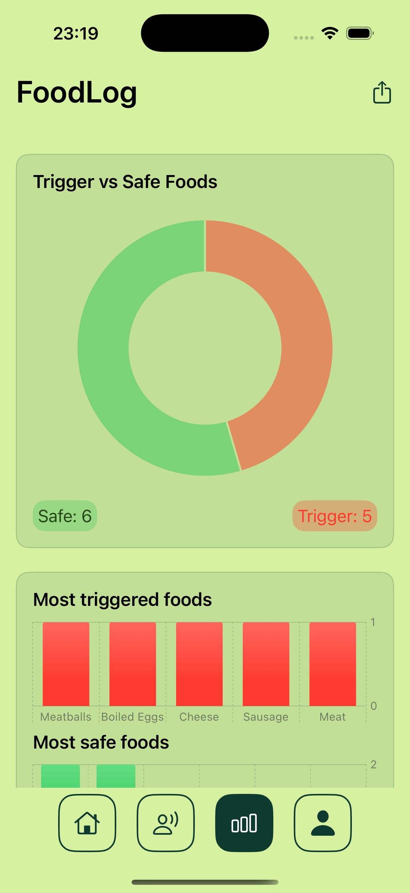
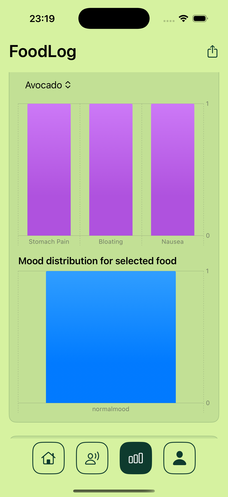
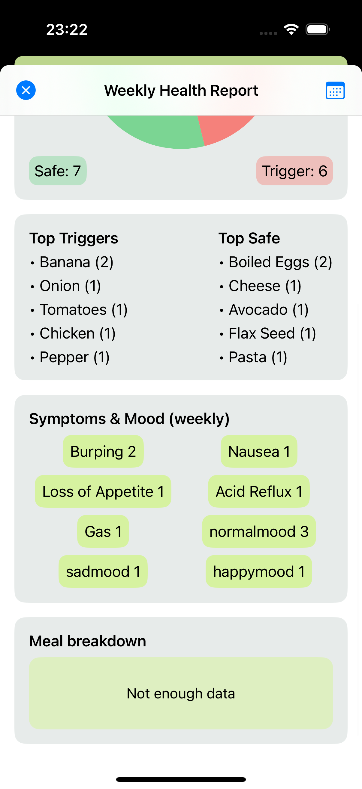
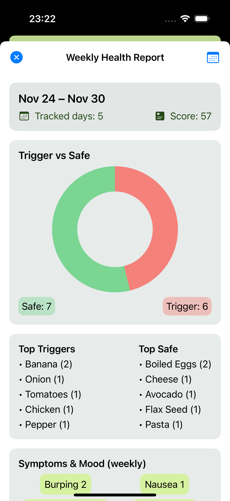
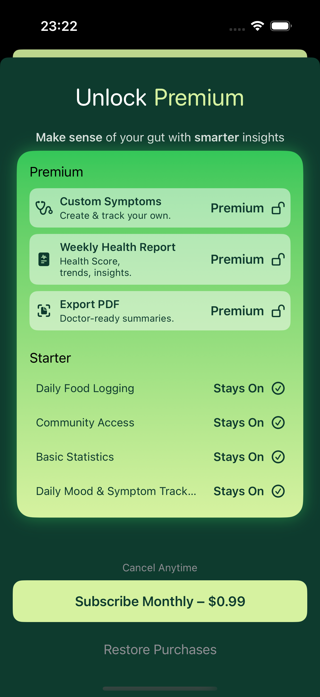

# Food-Log
**FoodLog** is a holistic health tracking application that helps users monitor their nutrition intake alongside their emotional well-being. Unlike standard calorie counters, FoodLog correlates what you eat with how you feel.

# FoodLog - Nutrition & Mood Tracker 🍎

[](https://apps.apple.com/tr/app/meal-symptom-foodlog/id6746221002)


## Overview

The app features a robust **reporting system** that visualizes weekly data and generates downloadable **PDF health reports** for users to share with their dietitians or doctors.

<p align="center">
  
  
  
  
  
  
  
</p>

## Key Features

* **Advanced Data Visualization:** Interactive charts to track calories, protein, carbs, and fat intake over time.
* **PDF Report Generation:** Users can export their weekly nutrition and mood summaries as professional PDF documents (Powered by `PDFKit`).
* **Mood Tracking:** Logs daily mood states to find patterns between diet and mental health.
* **Secure Authentication:** Firebase Auth integration for secure user login and data syncing.
* **Premium Model:** Integrated StoreKit for subscription management and premium features.

## Tech Stack & Architecture

* **Language:** Swift 5
* **UI Framework:** SwiftUI
* **Architecture:** MVVM (Model-View-ViewModel)
* **Core Frameworks:**
    * `PDFKit` (For generating dynamic health reports)
    * `Charts` / `SwiftCharts` (For statistical data visualization)
    * `StoreKit 2` (In-App Purchases)
    * `CoreData` (Local persistence for offline capability)
* **Backend:** Firebase (Authentication & Analytics)

## Highlight: PDF Generation

One of the core technical challenges in this project was creating dynamic PDF reports from SwiftUI views.

Installation
To run this project locally:

Clone the repository.

Add your own GoogleService-Info.plist to the root folder (Required for Firebase).

Build and run on Xcode 15+.

Author
Zerda Yılmaz Junior iOS Developer

Note: This project is live on the App Store. Some proprietary assets have been removed from this open-source version.

```swift
// Sample approach for PDF generation logic found in PDFHelper.swift
func createPDF(from data: WeeklyData) -> Data {
    let pdfMetaData = [
        kCGPDFContextCreator: "FoodLog App",
        kCGPDFContextAuthor: "User"
    ]
    let format = UIGraphicsPDFRendererFormat()
    format.documentInfo = pdfMetaData as [String: Any]
    
    // Rendering logic...
}
